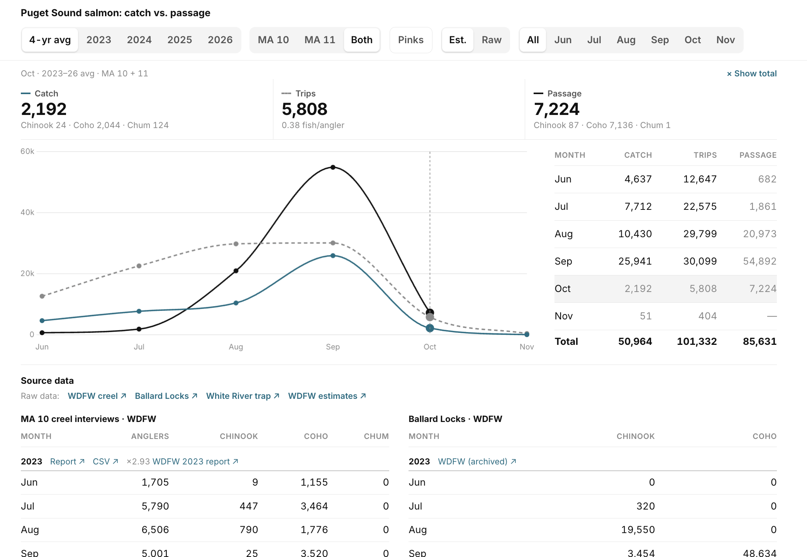

# `Fishing reports`

Analysis of fishing in Puget Sound areas 10 and 11, month by month, from public passage data and catch reports from previous years.


<div align="center">
  
[<kbd><br>haaans.com/fishreports<br><br></kbd>](https://haaans.com/fishreports)

</div>


<p align="center">

</p>

The page compares recreational salmon catch and angler effort in Marine Areas 10 (Seattle–Bremerton) and 11 (Tacoma–Vashon) with fish passage counts, June–November, 2023–2026. To run it locally, open `index.html` in a browser; there is no build step.

## What it shows

| Metric | Area | Source |
|---|---|---|
| Retained catch (Chinook, coho, chum; pink optional) | MA 10, MA 11 | WDFW Puget Sound creel interviews |
| Angler trips | MA 10, MA 11 | WDFW Puget Sound creel interviews |
| Passage | MA 10 | Ballard (Chittenden) Locks fish ladder counts |
| Passage | MA 11 | USACE Mud Mountain Dam fish passage facility (White River trap, Puyallup system) |

Filters (season, area, months, pinks, basis) apply to the whole page and are saved in the URL.

## Data sources

All data is public. Credit belongs to the agencies and tribes that collect it.

- **Washington Department of Fish and Wildlife (WDFW)**
  - [Puget Sound creel reports by year](https://wdfw.wa.gov/fishing/reports/creel/puget-annual): daily ramp and shore interview counts. The page sums them by month.
  - [Lake Washington salmon counts](https://wdfw.wa.gov/fishing/reports/counts/lake-washington): daily Ballard Locks counts by WDFW and the Muckleshoot Indian Tribe. Past seasons come from archived copies on the Internet Archive.
  - Summer mark-selective Chinook fishery post-season reports, used for the expansion factors: [2023](https://wdfw.wa.gov/publications/02502), [2024](https://wdfw.wa.gov/publications/02650), [2025](https://wdfw.wa.gov/publications/02697). The 2026 factor uses [in-season estimates](https://wdfw.wa.gov/fishing/reports/creel/seasonal).
- **U.S. Army Corps of Engineers, Seattle District**
  - [Mud Mountain Dam fish counts](https://www.nws.usace.army.mil/Missions/Civil-Works/Locks-and-Dams/Mud-Mountain-Dam/Fish-Counts/): 2023 and 2025 daily workbooks, now available only through the [Internet Archive](https://web.archive.org/).
  - Chittenden Locks count workbook for 2024 (final season totals; archived).
- **Puyallup Tribal Fisheries**
  - [Annual Salmon, Steelhead and Bull Trout Report 2024–25](https://www.puyalluptribe-nsn.gov/member-services/tribal-natural-resources/fisheries/annual-reports/): 2024 White River annual totals (USACE published no 2024 monthly counts) and a cross-check of the 2023 counts.

Every table in the page links to the record its numbers came from.

## Method and caveats

- **Estimated vs. Raw.** Creel interviews reach only about 1 in 3 anglers. **Raw** shows the interview counts as published. **Est.** (the default) multiplies them by an expansion factor for each area and season. The factor is WDFW's expanded angler-trip estimate divided by the anglers interviewed on the same Chinook-season days. Chinook, coho and pink scale up by the same ratio to within about 10%. Factors range from ×2.2 to ×3.5. They are measured during the summer Chinook season, so September–November values are an approximation.
- **Chum** are included in catch and passage, but the counts are small: creel sampling winds down before the late-fall chum run, and the Ballard Locks don't count chum.
- **Ballard Locks** counts Chinook from about Jun 18 and coho from Sep 1 to early October. October values are Oct 1–2 only, and there is no November count. Sockeye are listed but not charted.
- **White River trap:** monthly counts are missing for 2024 and 2026 (USACE never posted them), and 2025 ends on Sep 18.
- **Averages** use only the seasons that have data for that month. Combining both areas uses only seasons where both have data.
- All counts are preliminary and may be revised by the agencies.

## Updating

```bash
python3 update_data.py           # pull live sources, rewrite the data block in index.html
python3 update_data.py --check   # show what would change
```

The script refreshes the creel data, the current Ballard season and any USACE workbook currently posted
(`pip install openpyxl` for the workbook). Expansion factors come from PDF reports, so they are edited by hand
in `EST` in `index.html` when WDFW publishes a new post-season report.

## License

Code: MIT. Data belongs to its publishers (above).
